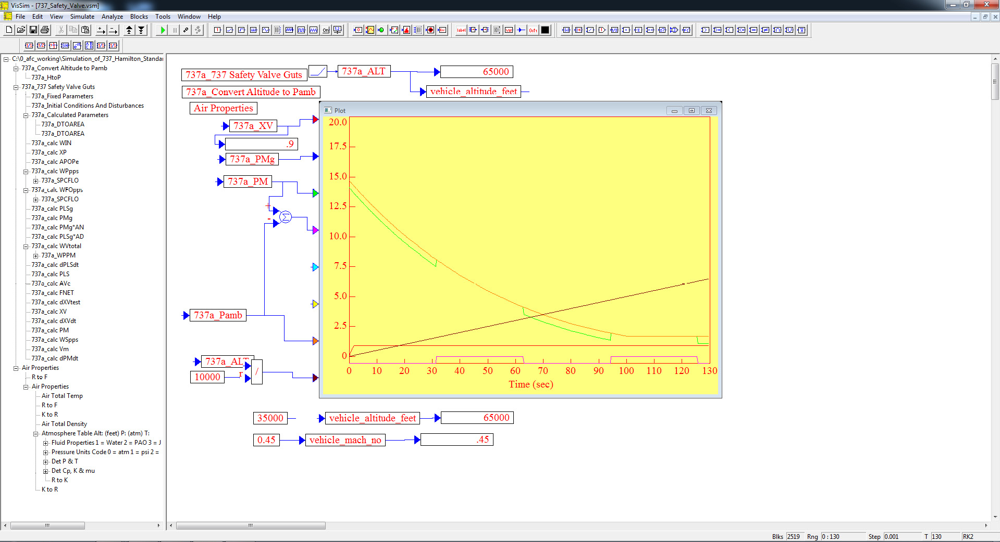
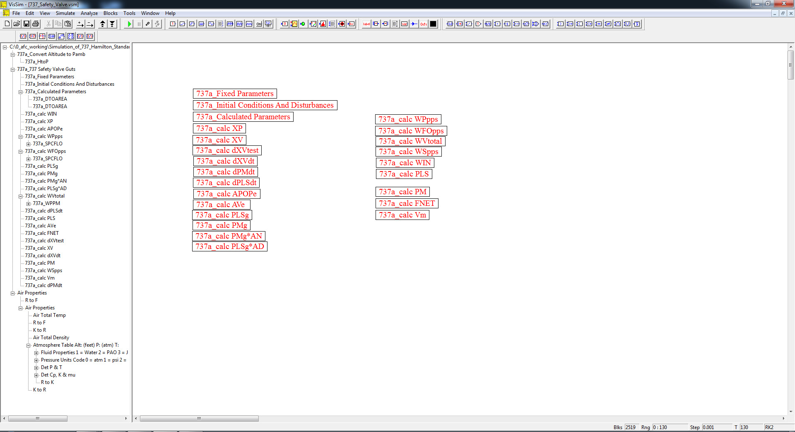
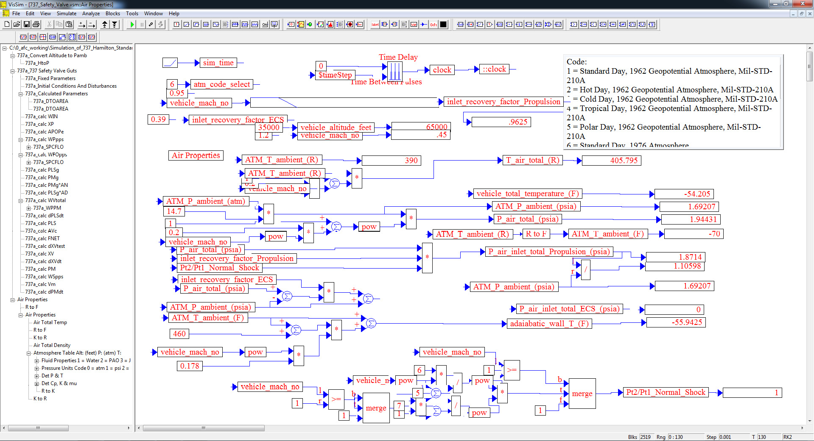

# ========================================
# Simulation of 737 Hamilton Standard Safety Valve with VISSIM:
# ========================================

## I. 737 Hamilton Standard Safety Valve Top Level Diagram:

## II. 737 Safety Valve Calculation Sub-System Level Diagram:

## III. Atmosphere Model Properties Calculation Sub-System Level Diagram:

## 
## *Note: Performance Data and Analysis performed using VISSIM, ( https://web.solidthinking.com/vissim-is-now-solidthinking-embed )
